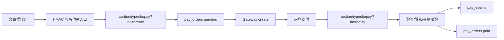

# TypechoPay Architecture

## 目标

Typecho 只承担订单中心职责：

- 渲染可信支付入口
- 创建订单
- 调用网关创建支付会话
- 接收并验签异步通知
- 幂等更新订单状态
- 保留事件审计

支付渠道被隔离在 `src/Gateways` 下，业务层不直接依赖某个支付 SDK。

## 请求路径

## 关键表

`pay_orders` 是订单事实表。`out_trade_no` 是商户侧唯一订单号，支付平台交易号只写入 `platform_trade_no`。

`pay_events` 是通知事件表。即使通知失败，也保留事件类型、签名结果和 payload 摘要，方便排查支付平台重试。

## 网关契约

每个网关实现：

- `create(array $order): PayCreateResult`
- `notify(array $headers, string $rawBody, array $query, array $post): NotifyResult`
- `query(array $order): NotifyResult`

网关只负责和支付平台通信、验签、把平台状态转换成统一结果。订单写入和状态流转只在 `OrderService` 中完成。

## 当前边界

此版本不是卡密/库存交付系统。已支付后的权益更新点已经保留在订单状态上，后续可以新增 `AccessService` 或独立交付插件订阅 paid 状态。
